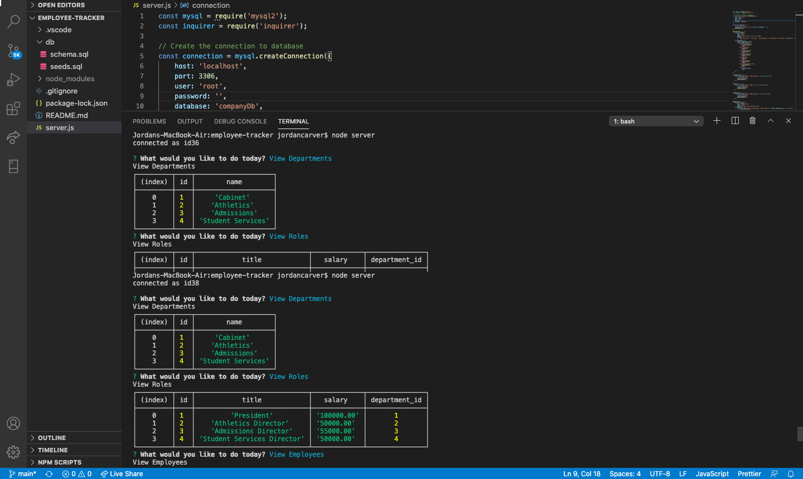

# employee-tracker

## Description 

Organize and plan your business with the employee-tracker! View and manage your company's departments, roles, and employees with this command-line application. 

## Demo

[Link to the YouTube Demo](https://youtu.be/15haGQQgzjk)

## Table of Contents
* [Installation](#installation)
* [Usage](#usage)
* [Credits](#credits)
* [License](#license)

## Installation
- git clone git@github.com:1jorcarver/employee-tracker.git 
- npm install --save mysql2
- npm install inquirer
- npm install console.table --save

## Usage
- Use node server in the terminal. 
- You will then be prompted with questions regarding your company.

## Credits
- Trilogy, Module 12
- U of U Boot Camp, Course Recorded Class

## License

## Contributing
*Please note that this project is released with a Contributor Code of Conduct. By participating in this project you agree to abide by its terms.*

## Questions
* GitHub Username: 1jorcarver
* GitHub Profile: https://github.com/1jorcarver
* Email: jordan_carver@hotmail.com